

+ [Ссылка на проект](https://teejay74.github.io/chaos-organizer/)

# Дипломное задание к курсу «Продвинутый JavaScript в браузере». Chaos Organizer 
## Обязательный функционал
* Сохранение в истории ссылок и текстовых сообщений
	- для сохранения ссылки или текстового сообщения, необходимо ввести в поле ввода необходимое сообщение:
		
	- отправка осуществляется по нажатию на кнопку "Enter" или иконку для отправки сообщений:
		
	
* Ссылки (то, что начинается с http:// или https://) должны быть кликабельны и отображаться как ссылки
	- 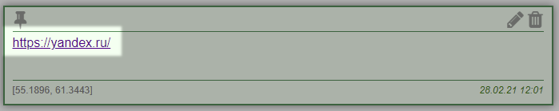 

* Сохранение в истории изображений, видео и аудио (как файлов) - через Drag & Drop и через иконку загрузки (скрепка в большинстве мессенджеров)
	- добавление файлов через иконку, осуществляется при нажатии иконки "скрепка"
		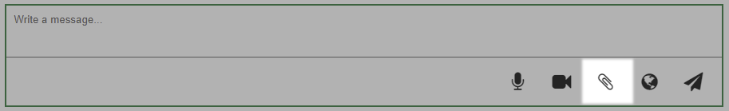 
	- через Drag & Drop 
		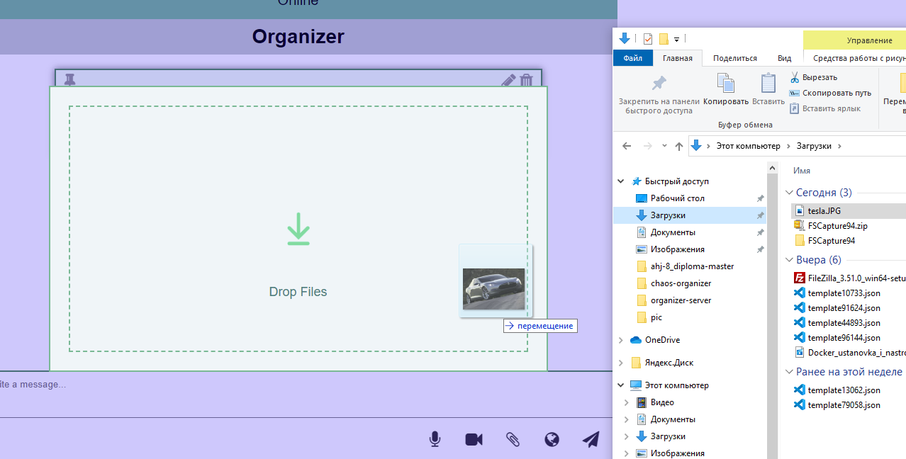 

* Скачивание файлов (на компьютер пользователя)
	- скачивание файлов, осуществляется по нажатию на соотвествующую икноку на определенной записи.
		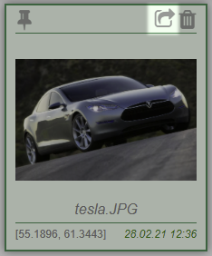 

* Ленивая подгрузка: сначала подгружаются последние 10 сообщений, при прокрутке вверх подгружаются следующие 10 и т.д.
	- при достижении 10 или более сообщений, после обновления страницы, отображается последние 10 сообщений. Для загрузки остальных сообщений, необходимо произвести scroll вверх.

## Дополнительный функционал 
* Синхронизация - если приложение открыто в нескольких окнах (вкладках), то контент должен быть синхронизирован
	- сообщения обновляются без перезагрузки страницы, во всех открытых клиентах. 

* Запись видео и аудио (используя API браузера)
	- запись видео и аудио, осуществляется по нажатию на соответсвующую иконку:
		аудио:
		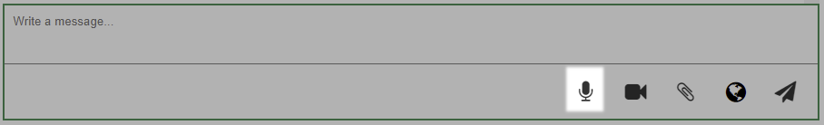 
		видео:
		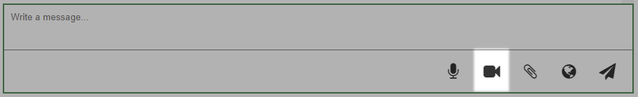 
	- по завершению записи, необходимо нажать кнопку "ОК"
		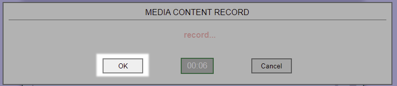 

* Отправка геолокации
	- отправка геолокации осуществляется по нажатию на соотвествующую иконку:
		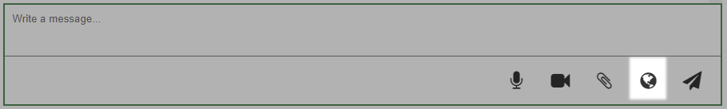 

* Воспроизведение видео/аудио (используя API браузера)
	- для воспроизведения видео или аудио файлов, необходимо нажать на кнопку play, у соотвествующего сообщения:
		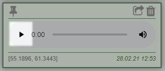 

* Закрепление (pin) сообщений, закреплять можно только одно сообщение (прикрепляется к верхней части страницы):
	- закрепление файлов, осуществляется по нажатию на соотвествующую икноку на определенной записи.
		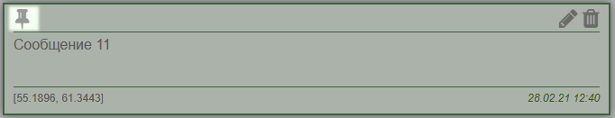 
	- для просмотра информации о закрепленном сообщении, необходимо нажать на иноку в верхней области сообщений:
		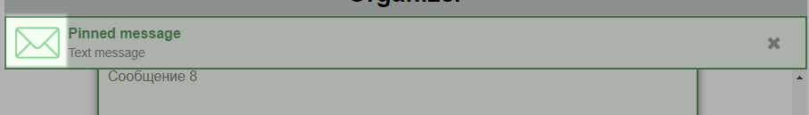 
