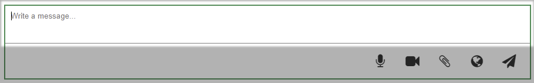
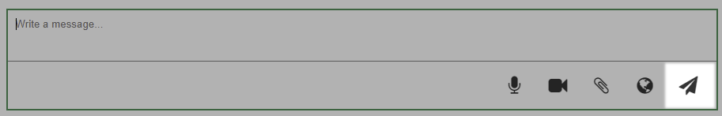

+ [Ссылка на проект](https://teejay74.github.io/chaos-organizer/)

# Дипломное задание к курсу «Продвинутый JavaScript в браузере». Chaos Organizer 
## Обязательный функционал
* Сохранение в истории ссылок и текстовых сообщений
	- Вставьте ссылку или текстовое сообщение в поле ввода сообщений:
		
	- Нажмите кнопку "Enter" или иконку для отправки сообщений:
		
	**Важно**: поле не должно быть пустым.

* Ссылки (то, что начинается с http:// или https://) должны быть кликабельны и отображаться как ссылки

* Сохранение в истории изображений, видео и аудио (как файлов) - через Drag & Drop и через иконку загрузки (скрепка в большинстве мессенджеров)

* Скачивание файлов (на компьютер пользователя)

* Ленивая подгрузка: сначала подгружаются последние 10 сообщений, при прокрутке вверх подгружаются следующие 10 и т.д.

## Дополнительный функционал 
* Синхронизация - если приложение открыто в нескольких окнах (вкладках), то контент должен быть синхронизирован
* Запись видео и аудио (используя API браузера)
* Отправка геолокации
* Воспроизведение видео/аудио (используя API браузера)
* Закрепление (pin) сообщений, закреплять можно только одно сообщение (прикрепляется к верхней части страницы):